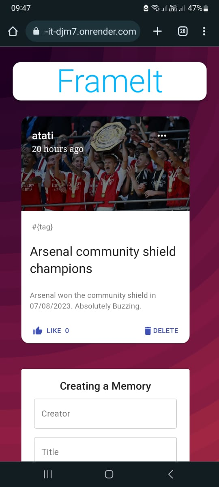

# Frame It - A MERN Stack Photo Sharing Application

## Overview

Frame-It is a full-stack web application built on the MERN (MongoDB, Express, React, Node.js) stack that allows users to upload and share their favorite pictures along with short descriptions. It provides a simple and elegant platform for users to showcase their memorable photos.

## Features

- User-friendly interface for easy navigation and photo management.
- Upload and store photos securely on the database.
- Write and edit descriptions to accompany each photo.
- Like on photos to engage with other users.
- Mobile-responsive design for seamless browsing on any device.

## Installation and Setup

1. Clone the repository: `git clone https://github.com/your-username/frame-it.git`
2. Install server dependencies: `npm install`
3. Install client dependencies: `cd client && npm install`
4. Set up your MongoDB Atlas cluster and obtain the connection URI.
5. Create a `.env` file in the root directory and add the following environment variables:
6. Run the server and client concurrently: `npm run dev`

## Technologies Used

- MongoDB: NoSQL database for storing photos and descriptions.
- Express: Backend framework for building RESTful APIs.
- React: Frontend library for creating dynamic user interfaces.
- Node.js: Server-side runtime environment.
- Cloudinary: Cloud-based storage for photos.

## Deployment

The live version of Frame It is deployed on Render and can be accessed [here](https://frame-it-djm7.onrender.com/).

## API Endpoints

- GET `/api/photos`: Fetch all uploaded photos.
- POST `/api/photos`: Upload a new photo.
- PUT `/api/photos/:id`: Update the description of a photo.
- DELETE `/api/photos/:id`: Delete a photo.

## Contact

For any questions or inquiries, feel free to reach out to us at atatisam14@gmail.com or connect with us on LinkedIn:
## License

This project is licensed under the MIT  - see the [LICENSE.md](./LICENSE.md) file for details.
